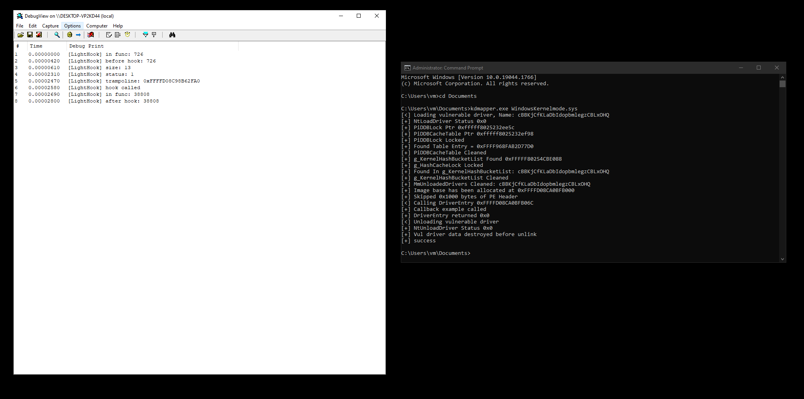

Single-header, minimalistic, cross-platform hook library written in pure C.

## But... why?
While other well-written libraries that do exactly the same already exist, I wanted to have something simple that would not use an entire disassembler engine which can sometimes be painful to include in a project. 

**Pros of this library:**
- Written in pure C
- No dependencies (no full disassembler engine)
- Single header
- Works in both kernelmode/usermode
- Cross-platform (Windows/Linux/EFI)
- Easily portable (3 functions to allocate/free/protect memory that are platform specific)

**Cons of this library:**
- Breaks when a function starts with unsupported instructions (ex. AVX)

## Showcase




## Usage
Include the [header file](https://github.com/SamuelTulach/LightHook/blob/main/Source/LightHook.h) in your project. Initialise hook structure by calling `CreateHook`. Perform the actual hook by calling `EnableHook` and optionally revert the hook with a call to `DisableHook`.

```
HookInformation info = CreateHook((void*)&FunctionToHook, (void*)&FunctionToCall);
int status = EnableHook(&info);
if (status != 0)
    return;

// Call the original function with info.Trampoline
FunctionToHook(10, 20);

DisableHook(&info)
```

## License
This repository is licensed under MIT if not stated otherwise in subfolders.